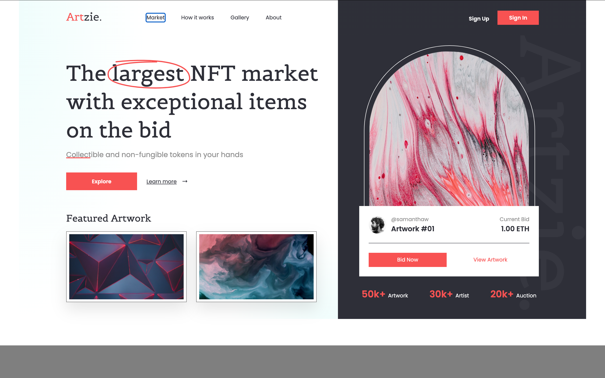

# Proyecto 4 - NFT Marketplace

Landing page de un marketplace de NFTs desarrollada como proyecto de práctica de maquetación web.

El objetivo del proyecto ha sido reproducir con la mayor fidelidad posible un diseño de Figma, adaptándolo de 1920px a un ancho fijo de 1200px.

## 🖥️ Vista previa

## 🚀 Tecnologías utilizadas

- HTML5
- Sass / SCSS
- Vite
- CSS Grid
- Flexbox
- Git
- GitHub

## 🎨 Características

- Maquetación basada en un diseño de Figma
- Header con navegación y botones de acceso
- Hero dividido en dos columnas
- Elementos decorativos realizados con Sass
- Sección Featured Artwork
- Tarjeta de puja superpuesta sobre la obra principal
- Estadísticas de artworks, artistas y subastas
- Variables y mixins con Sass
- Diseño de escritorio a 1200px

## 📁 Estructura del proyecto

    proyecto4-marketplace/
    ├── public/
    │   └── img/
    ├── sass/
    │   ├── _mixins.scss
    │   ├── _variables.scss
    │   └── style.scss
    ├── index.html
    ├── package.json
    ├── preview_proyecto4.png
    └── README.md

## 👩‍💻 Autora

**Neus Gil**

Proyecto realizado como parte de mi aprendizaje de desarrollo web.
